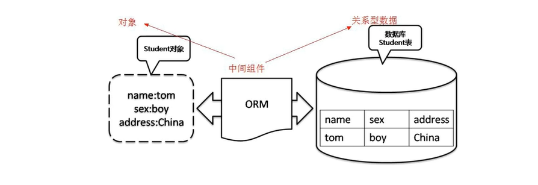
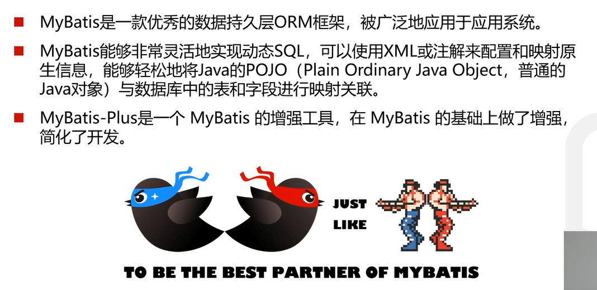

## ORM介绍
### 1. ORM(object relational mapping, 对象关系映射)是为了解决面向对象与关系数据库存在互不匹配现象的一种技术
### 2. ORM通过使用描述对象和数据库之间映射的元数据将程序中的对象自动持久化到关系数据库中
### 3，ORM框架的本质是简化编程中操作数据库的编码

### *ORM主要就是将数据库中记录和对象完成映射，既包含了存储又包含了读取*

## Mybatis-Plus介绍

